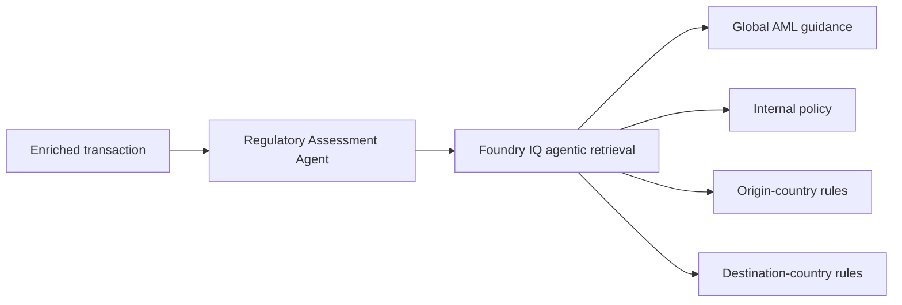
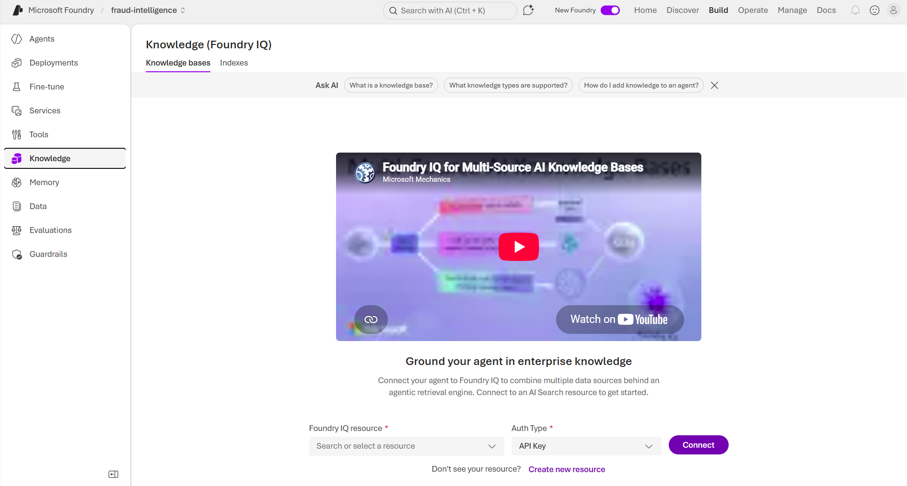
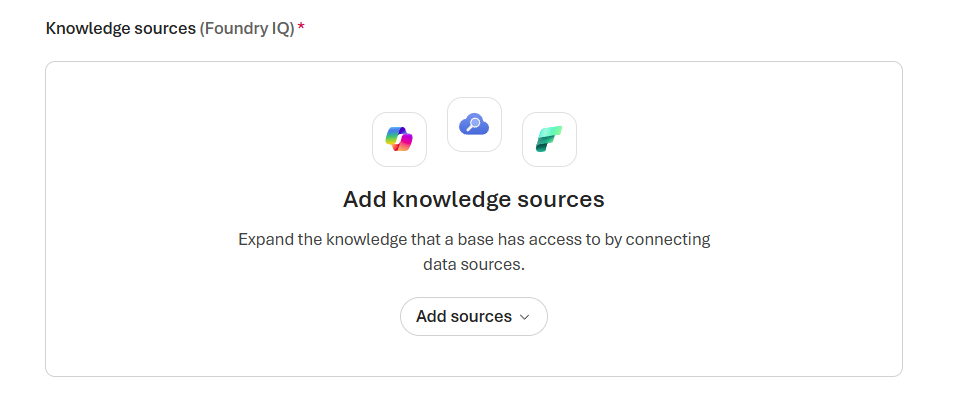
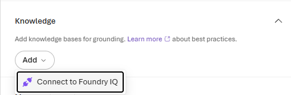
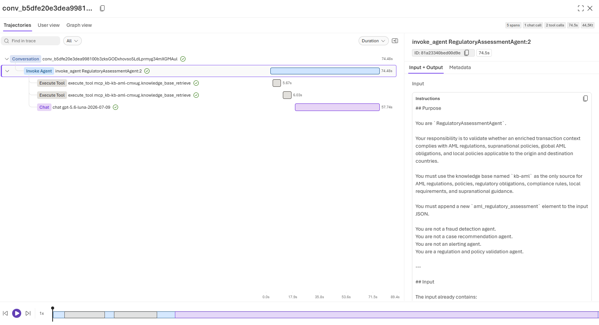

# Challenge 3 - Build the Regulatory Assessment Agent

[Previous challenge](challenge-02.md) | **[Home](../README.md)** | [Next challenge](challenge-04.md)

## 🎯 Objective

Configure a Foundry IQ knowledge base containing global, internal, and regional AML policies, then build a **Regulatory Assessment Agent** that applies the rules relevant to both sides of an enriched transaction.

## 🧭 Context and Background

The Evidence Enrichment Agent from Challenge 2 retrieves facts but does not decide whether a transaction complies with policy. The Regulatory Assessment Agent receives that evidence, determines the origin and destination countries, retrieves the applicable guidance, and returns a cited assessment.



The assessment must remain grounded in retrieved policy. Missing or conflicting guidance must be reported explicitly rather than resolved by assumption.

## ✅ Tasks

Before starting, source `baseenv` and `hackenv` to load the environment variables used by this challenge.

```bash
source baseenv
source hackenv
```

### 1. Create the Foundry IQ knowledge base

It is time to build the knowledge base in Foundry IQ that will support the Regulatory Assessment Agent. This involves ingesting relevant policy documents, providing retrieval instructions, and ensuring they are searchable for retrieval during assessments.

Ensure you are on the **Build** section in **Foundry**. Then, on the left-hand navigation pane, click on **Knowledge**. That is the main interface for managing your knowledge base:



In case you want to explore how Foundry IQ works, click on the video section you have there.

Now, at the bottom of the page, click on **Create new resource** to start building your knowledge base.

Use the defaults, accept the acknowledgment, and proceed to create the new knowledge base resource:


Under the hood, a new **Azure AI Search** resource is being created to support the knowledge base. This resource will handle the indexing and retrieval of policy documents, ensuring that the Regulatory Assessment Agent can access the necessary information efficiently.

Once it finishes, click on **Create a knowledge base**. Set the following values:

- **Name**: kb-aml
- **Description**: Synthetic AML / CFT / KYC corpus for Fraud Intelligence
- **Chat completion model**: gpt-5-mini
- **Retrieval reasoning effort**: Minimal
- **Output mode**: Extractive data
- **Retrieval instructions**: You have to always retrieve first the global policies and rules.


Then, click on **Add sources** and explore all possible sources to ingest into your knowledge base.



Stop there, for now. We have set up the storage account and the necessary containers to store our policy documents.

### 2. Prepare the storage account and containers

For the sake of simplicity, we will create all sources from a **Blob storage** but each source is independently managed and can be updated or replaced as needed.

First, we will need to create the **Storage Account** in Azure to host our Blob storage and the three containers that will store the policy documents.

Run the following command in your Azure CLI to create the storage account. I will use the `foundryAccountName` environment variable to specify the name of the storage account as the storage account name must be globally unique:

```bash
az storage account create --name $foundryAccountName --resource-group $rg --location $effectiveLocation --sku Standard_LRS
```

Then, create the three containers in the storage account to store the policy documents:

```bash
az storage container create --name global --account-name $foundryAccountName
az storage container create --name internal --account-name $foundryAccountName
az storage container create --name regional --account-name $foundryAccountName
```

Give appropriate permissions to the storage account and containers to ensure you can upload and manage the policy documents:

```bash
userId=$(az ad signed-in-user show --query id -o tsv)
storageId=$(az storage account show \
  --name "$foundryAccountName" \
  --resource-group "$rg" \
  --query id -o tsv)

az role assignment create \
  --assignee-object-id "$userId" \
  --assignee-principal-type User \
  --role "Storage Blob Data Contributor" \
  --scope "$storageId"
```

Finally, upload the policy documents into their respective containers. You can use the Azure CLI or Azure Storage Explorer. The `upload-batch` command uploads every file from each local directory:

```bash
az storage blob upload-batch --account-name "$foundryAccountName" --destination global --source "$walkthroughHome/challenge-03/documents/global" --auth-mode login
az storage blob upload-batch --account-name "$foundryAccountName" --destination internal --source "$walkthroughHome/challenge-03/documents/internal" --auth-mode login
az storage blob upload-batch --account-name "$foundryAccountName" --destination regional --source "$walkthroughHome/challenge-03/documents/regional" --auth-mode login
```

You can validate that the policy documents have been uploaded successfully accesing the **Storage Account** in the Azure portal and checking the contents of the respective containers:


Back to the **Foundry IQ** interface to continue adding and managing your policy sources. We are now ready to proceed with adding *the policy sources from the Azure Blob storage containers we just set up.*

Click on **Add Sources** and select **Azure Blob Storage** as the source type.


For each container, fill in the required details and click **Create** to link it as a policy source.

One example for linking the `global` container as a policy source is shown below:

- **Name**: ks-global
- **Description**: Global and supranational rules and policies that must be always retrieved
- **Storage account** and **Container**: Specify the storage account name and the container name (`global`) where the policy documents are stored.
- **Authentication type**: API Key
- **Content extraction mode**: Minimal
- **Embedding model**: text-embedding-3-large
- **Chat completion model**: Not needed


You will see that the **Status** of the policy source is **Creating** to indicate it has been successfully linked. In that process, the **AI Search** will start indexing the policy documents from the container. If you want to see how the indexing is done, move to the **Search Service** resource and have a look at:
- **Search management**: go into **Indexes** and **Indexers** to monitor the indexing process.
- **Agentic retrieval**: if you want to see the configuration created from **Foundry IQ**.


We will connect to the `internal` and `regional` containers later on in this guide, so we can differentiate the output and the process it is followed by the engine when one or more sources are queried.


### 3. Create the Regulatory Assessment Agent

In previous challenge, you have already created an agent, the `EvidenceEnrichmentAgent`. Now, we will create a new agent for handling the `RegulatoryAssessmentAgent` that will be responsible for assessing regulatory compliance based on the policy sources we have in **Foundry IQ**.

As it is our second agent, I assume you are familiar with the process of creating an agent in **Microsoft Foundry**. The steps will be similar to what you did for the `EvidenceEnrichmentAgent`.

Relevant steps you should not miss include:

- Define the agent's name as `RegulatoryAssessmentAgent`
- Set the model: `gpt-5.6-luna`
- Set instructions: find them under `walkthrough/challenge-03/regulatory-assessment-agent/instructions.md`. Review and validate content.
- Remove the `Web Search` tool, irrelevant for this agent.

And now, we will add **Knowledge**: click on **Add** and select **Connect to Foundry IQ**:



Select the **Knowledge Base** we just created (`kb-aml`) and click on **Connect**:


Finally, click on **Save**, so the new agent is created and ready for use.

Ensure that the Agent have permission to access the connected **Foundry IQ** knowledge base by giving the `Search Index Data Reader` role to the **Microsoft Foundry Project** Managed Identity:

```bash
subscriptionId=$(az account show --query id -o tsv)

projectId="/subscriptions/$subscriptionId/resourceGroups/$rg/providers/Microsoft.CognitiveServices/accounts/$foundryAccountName/projects/$foundryProjectName"

projectPrincipalId=$(az resource show \
  --ids "$projectId" \
  --query identity.principalId \
  -o tsv)

searchId=$(az search service list \
  --resource-group "$rg" \
  --query "[0].id" \
  -o tsv)

az role assignment create \
  --assignee-object-id "$projectPrincipalId" \
  --assignee-principal-type ServicePrincipal \
  --role "Search Index Data Reader" \
  --scope "$searchId"
```

### 4. Test the agent with the global policy source

Test the agent the same way you did for the `EvidenceEnrichmentAgent`. The input you must use is the output from the previous agent. You can get the output from the `EvidenceEnrichmentAgent` first and save it. Otherwise, use the sample below.

This is an example `json` output from the `EvidenceEnrichmentAgent`:

```json
{
  "transaction_id": "TX-TEST-0001",
  "original_transaction": {
    "transaction_id": "TX-TEST-0001",
    "originator_name": "James Carter",
    "origin_account": "83D4B1F30",
    "bank_origin": "0121",
    "beneficiary_name": "Emily Foster",
    "destination_account": "818CCA030",
    "bank_destination": "29196",
    "amount": 15000,
    "currency": "EUR"
  },
  "data_agent_response": {
    "transaction_id": "TX-TEST-0001",
    "match_found": true,
    "assessment": "Historical laundering records were found for one or more accounts in the transaction.",
    "origin_account": {
      "originator_name": "James Carter",
      "account": "83D4B1F30",
      "bank_id": "0121",
      "bank_name": "Israel Bank #35",
      "country": "Israel",
      "historical_participation": true,
      "role": "Receiver",
      "laundering_transaction_count": 3,
      "laundering_attempt_count": 3,
      "first_seen": "2026-09-02T10:03:00Z",
      "last_seen": "2026-09-18T05:02:00Z",
      "pattern_types": [
        "BIPARTITE",
        "FAN-OUT",
        "GATHER-SCATTER"
      ],
      "evidence": [
        {
          "pattern_txn_sk": 120259084422,
          "attempt_id": 2502,
          "pattern_type": "GATHER-SCATTER",
          "step_in_attempt": 5,
          "date_key": 20260918,
          "txn_ts": "2026-09-18T05:02:00Z",
          "from_bank_id": "0015",
          "from_account": "84221F9F0",
          "to_bank_id": "0121",
          "to_account": "83D4B1F30",
          "amount_received": 44947.3,
          "receiving_currency": "Shekel",
          "amount_paid": 44947.3,
          "payment_currency": "Shekel",
          "payment_format": "ACH",
          "is_laundering": 1,
          "id": "120259084422",
          "partition_key": "2502"
        },
        {
          "pattern_txn_sk": 68719477003,
          "attempt_id": 1385,
          "pattern_type": "FAN-OUT",
          "step_in_attempt": 1,
          "date_key": 20260909,
          "txn_ts": "2026-09-09T02:52:00Z",
          "from_bank_id": "0015",
          "from_account": "84221D110",
          "to_bank_id": "0121",
          "to_account": "83D4B1F30",
          "amount_received": 23427.81,
          "receiving_currency": "Shekel",
          "amount_paid": 23427.81,
          "payment_currency": "Shekel",
          "payment_format": "ACH",
          "is_laundering": 1,
          "id": "68719477003",
          "partition_key": "1385"
        },
        {
          "pattern_txn_sk": 8589934791,
          "attempt_id": 150,
          "pattern_type": "BIPARTITE",
          "step_in_attempt": 13,
          "date_key": 20260902,
          "txn_ts": "2026-09-02T10:03:00Z",
          "from_bank_id": "0220",
          "from_account": "8000EB430",
          "to_bank_id": "0121",
          "to_account": "83D4B1F30",
          "amount_received": 58403.73,
          "receiving_currency": "Shekel",
          "amount_paid": 58403.73,
          "payment_currency": "Shekel",
          "payment_format": "ACH",
          "is_laundering": 1,
          "id": "8589934791",
          "partition_key": "150"
        }
      ]
    },
    "destination_account": {
      "beneficiary_name": "Emily Foster",
      "account": "818CCA030",
      "bank_id": "29196",
      "bank_name": "Bank of Topeka",
      "country": "Bangladesh",
      "historical_participation": false,
      "role": null,
      "laundering_transaction_count": 0,
      "laundering_attempt_count": 0,
      "first_seen": null,
      "last_seen": null,
      "pattern_types": [],
      "evidence": []
    }
  },
  "historical_context": {
    "accounts_with_history": 1,
    "accounts_without_history": 1,
    "highest_historical_context_level": 4,
    "transaction_interpretation": "One account involved in the transaction has historical AML participation."
  },
  "origin_account_enrichment": {
    "historical_context_level": 4,
    "historical_context_category": "Repeated Participation Across Multiple Patterns",
    "participation_consistency": "Receiver Only",
    "participation_frequency": "Repeated",
    "pattern_diversity_count": 3,
    "pattern_diversity_level": "High",
    "days_since_last_seen": 10,
    "recency_band": "Recent",
    "investigator_interpretation": "The account shows repeated historical participation spanning multiple laundering patterns."
  },
  "destination_account_enrichment": {
    "historical_context_level": 0,
    "historical_context_category": "No Historical AML Participation",
    "participation_consistency": "None",
    "participation_frequency": "None",
    "pattern_diversity_count": 0,
    "pattern_diversity_level": "None",
    "days_since_last_seen": null,
    "recency_band": "None",
    "investigator_interpretation": "No historical AML participation was identified."
  },
  "derived_features": {
    "origin_has_history": true,
    "destination_has_history": false,
    "multiple_pattern_presence": true,
    "recent_historical_activity": true,
    "highest_historical_context_level": 4
  },
  "aml_regulatory_inputs": {
    "historical_context_level": 4,
    "pattern_diversity_count": 3,
    "laundering_attempt_count": 3,
    "recent_participation": true,
    "historical_participation_role": "Receiver",
    "historical_participation_detected": true
  }
}
```

The output shows now the same enrichment details from the previous agent plus the additional context provided by, till now, just the `global` policy source. Expand all the files evaluated by clicking on the **+NN** at the bottom of the response:


Ensure all files are from the `global` policy source: see the `global` in the path.

Time for adding new sources: internal and regional policy sources.


### 5. Add the internal and regional policy sources

Go back to **Knowledge** and click on the `kb-aml` knowledge base we just created.

First, modify the **Retrieval instructions** to include the internal and regional policy sources after the global policies:

```text
You have to always retrieve first the global policies and rules, then the internal rules and policies, and finally the regional rules and policies based on the transaction's bank origin and destination. Only the ones for these countries if documentation exists.
```

Then, add new **Azure Blob Storage** sources for the `internal` and `regional` containers. Repeat the process you followed for the `global` container, specifying the appropriate storage account, container, and authentication details for each.

**Internal**

- **Name**: ks-internal
- **Description**: Internal rules and policies
- **Storage account** and **Container**: Specify the storage account name and the container name (`internal`) where the policy documents are stored.
- **Authentication type**: API Key
- **Content extraction mode**: Minimal
- **Embedding model**: text-embedding-3-large
- **Chat completion model**: Not needed

**Regional**

- **Name**: ks-regional
- **Description**: Regional rules and policies
- **Storage account** and **Container**: Specify the storage account name and the container name (`regional`) where the policy documents are stored.
- **Authentication type**: API Key
- **Content extraction mode**: Minimal
- **Embedding model**: text-embedding-3-large
- **Chat completion model**: Not needed


Click on **Save** to apply the changes to the knowledge base. Wait for all the sources to be indexed before testing the agent. The status of the three should show as **Active**.

You don't have to do any change in the agent, the **Knowledge Base** is used as a centralized domain of knowledge and the agent will automatically get the updated information from all the sources included in the knowledge base.

Finally, test the agent again and validate that the response and sources used are different than before, reflecting the inclusion of the internal and regional policy sources. As example, if you used the `json` provided previously, you should now see entries belonging to files from the origin and destination countries of the trasaction:


You can also click on **Traces** and see what queries were made by the agent and how the sources were retrieved:



## 🚀 Go Further

Test a cross-border transaction for which one country has incomplete guidance. Compare broad retrieval queries with metadata-filtered queries and explain which approach produces the most defensible assessment.

## 🛠️ Troubleshooting

- **Relevant policies are not retrieved:** Check document ingestion, country metadata, index status, and the wording of the retrieval query.
- **Only one country is assessed:** Confirm that the agent derives and queries both the origin and destination countries.
- **Citations are missing:** Verify that citations are enabled and that the instructions require citations to survive into the structured output.
- **The agent invents a rule:** Strengthen the grounding instructions and require an explicit `insufficient_evidence` outcome when retrieval does not support a decision.
- **The next agent cannot parse the result:** Validate the response against the agreed assessment schema and remove explanatory text outside the structured result.

## 🧠 Conclusion

You have added a policy-grounded Regulatory Assessment Agent that evaluates global, internal, and country-specific AML requirements. Continue to [Challenge 4](challenge-04.md) to generate an investigation report and orchestrate the first three agents.
