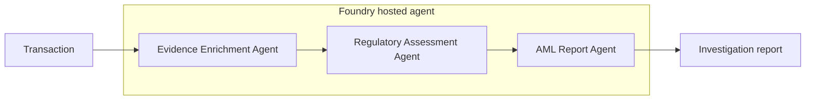

# Challenge 4 - Build and Orchestrate the Investigation

[Previous challenge](challenge-03.md) | **[Home](../README.md)** | [Next challenge](challenge-05.md)

> **Scaffold status:** This challenge defines the intended learner journey and validation criteria. Replace the marked `TODO` items when the report schema and Microsoft Agent Framework project are added to the repository.

## 🎯 Objective

Build an **AML Report Agent**, compose it with the Evidence Enrichment and Regulatory Assessment agents using the **Microsoft Agent Framework**, and deploy the workflow as a hosted agent in Microsoft Foundry.

## 🧭 Context and Background

The first two agents produce evidence and a regulatory decision. The AML Report Agent converts those structured inputs into a consistent, audit-ready investigation report without changing the underlying facts or assessment.

The orchestration owns sequencing, state transfer, failure handling, and the final response. Each specialist agent retains a narrow responsibility.

## ✅ Tasks

### 1. Define the investigation report contract

Review the enriched transaction and regulatory assessment schemas. Define a report contract that includes, at minimum:

- Case and transaction identifiers
- Parties, accounts, banks, countries, amount, and currency
- Evidence summary and evidence references
- Applicable policies and citations
- Findings, overall regulatory status, and rationale
- Missing or conflicting information
- Recommended analyst actions
- Generation timestamp and agent/version metadata

The report must preserve source identifiers so an analyst can trace each finding back to evidence or policy.

> **TODO:** Add the canonical report schema and a representative expected report under `walkthrough/challenge-04/`.

### 2. Create the AML Report Agent

Create an agent named `AmlReportAgent` using the lab's chat model deployment. Give it no external retrieval or mutation tools; it should transform only the supplied evidence and assessment.

Write instructions that require the agent to preserve the regulatory status, avoid adding facts, separate missing information from confirmed findings, and emit the agreed report format.

Test the agent independently with a saved assessment from Challenge 3.

> **TODO:** Add `walkthrough/challenge-04/aml-report-agent/instructions.md` after the report contract is finalized.

### 3. Scaffold the Agent Framework orchestration

Create a Python project for the hosted workflow and add the Microsoft Agent Framework dependencies. Configure Azure authentication with `DefaultAzureCredential`; do not store credentials in source control.

Implement the workflow so that it:

1. Accepts and validates a transaction payload.
2. Invokes `EvidenceEnrichmentAgent`.
3. Passes the enriched transaction to `RegulatoryAssessmentAgent`.
4. Passes the evidence and assessment to `AmlReportAgent`.
5. Returns the final report together with correlation metadata.
6. Stops safely and reports which stage failed when an agent returns invalid output.

Use structured models at every handoff rather than parsing prose.

> **TODO:** Add the starter project under `walkthrough/challenge-04/fraud-intelligence-orchestrator/`, including dependencies, environment template, schemas, and tests.

### 4. Run and validate the workflow locally

Run the orchestrator with the canonical transaction from Challenge 2. Verify the ordering and data passed between agents, then test at least one invalid payload and one agent failure.

The successful output must contain an audit-ready report; failures must not silently continue with incomplete state.

> **TODO:** Add the local run command and expected output after the orchestrator entry point is available.

### 5. Deploy and test the hosted agent

Deploy the orchestrator to the existing Microsoft Foundry project as a hosted agent. Use managed identity and least-privilege role assignments for access to the remote agents and dependent services.

Invoke the deployed workflow with the canonical transaction and confirm that its result matches the local contract. Record the hosted agent name and version for later challenges.

> **TODO:** Add the deployment and invocation commands after the hosted-agent project metadata is finalized.

## 🚀 Go Further

Add idempotent case identifiers and checkpointing so a transient failure can resume without repeating completed investigation stages.

## 🛠️ Troubleshooting

- **A remote agent cannot be invoked:** Verify the project endpoint, agent name and version, managed identity, and role assignments.
- **A handoff fails validation:** Compare the producing agent's output with the consuming schema and inspect the raw response in the trace.
- **The report changes the decision:** Ensure the report agent receives the assessment as authoritative and has no instruction to reassess it.
- **Local authentication fails:** Sign in with the lab identity and confirm that `DefaultAzureCredential` selects the intended credential.
- **Hosted deployment fails:** Review the build logs, entry point, dependency versions, environment variables, and hosted-agent health status.

## 🧠 Conclusion

You have composed evidence enrichment, regulatory assessment, and reporting into a deployable investigation workflow. Continue to [Challenge 5](challenge-05.md) to govern model and MCP traffic and add operational alerting.
