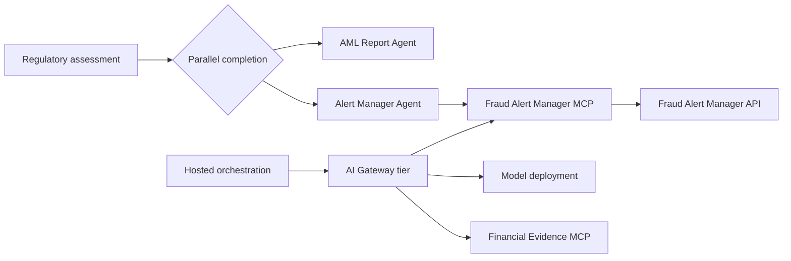

# Challenge 5 - Govern Models and MCP Servers

[Previous challenge](challenge-04.md) | **[Home](../README.md)** | [Next challenge](challenge-06.md)

> **Scaffold status:** This challenge defines the intended learner journey and validation criteria. Replace the marked `TODO` items when the AI Gateway configuration, Fraud Alert Manager API specification, and alert agent assets are available.

## 🎯 Objective

Introduce the **AI Gateway tier (preview)** for governed model and MCP access, generate an MCP interface from the Fraud Alert Manager API, build an **Alert Manager Agent**, and run alert creation in parallel with report generation.

## 🧭 Context and Background

The investigation workflow now produces a decision, but a decision that requires action must also reach the operational alert system. AI Gateway provides a shared policy and observability boundary for model and tool traffic.

The Alert Manager Agent must treat the regulatory assessment as authoritative. It decides whether to call the alert tool according to an explicit rule, but it does not re-evaluate the transaction.

## ✅ Tasks

### 1. Configure governed model access

Open the AI Gateway configuration supplied for the lab and expose the model deployment used by the agents. Apply the lab's authentication, rate-limit, and content-safety policies.

Update the orchestration configuration to use the gateway endpoint without committing keys or secrets. Prefer managed identity where the preview feature supports it.

Validate a successful model request and inspect the gateway activity or metrics.

> **TODO:** Add exact gateway creation and model routing steps after the preview configuration and lab resource names are finalized.

### 2. Proxy the Financial Evidence MCP

Register the Financial Evidence MCP from Challenge 2 behind AI Gateway. Preserve its existing key at the gateway boundary or replace it with the approved managed authentication pattern.

Update `EvidenceEnrichmentAgent` to use the governed MCP endpoint. Run the Challenge 2 transaction and confirm that evidence retrieval still works through the proxy.

> **TODO:** Add the proxy endpoint format, policy configuration, and validation screenshots.

### 3. Generate an MCP from the Fraud Alert Manager API

Review the supplied OpenAPI description before importing it. Identify the operation used to create an alert, its required fields, authentication requirements, and possible error responses.

Create an MCP interface for the API through AI Gateway. Expose only the operations required by this workflow and test the generated tool with a non-production case identifier.

> **TODO:** Add the Fraud Alert Manager OpenAPI document, endpoint, authentication setup, and test payload under `walkthrough/challenge-05/`.

### 4. Create the Alert Manager Agent

Create an agent named `AlertManagerAgent` and connect only the generated Fraud Alert Manager MCP. Define an explicit alerting rule based on the supplied regulatory status.

The instructions must require the agent to:

- Accept the assessment without changing it
- Create an alert only when the configured status requires one
- Send the minimum operational data required by the API
- Use a stable idempotency or case key to avoid duplicate alerts
- Return either structured alert details or a structured `not_required` result
- Surface tool failures without claiming that an alert was created

> **TODO:** Add the alerting rule, agent instructions, and input/output schemas after the API contract is finalized.

### 5. Add parallel report and alert branches

Extend the Agent Framework workflow after regulatory assessment. Run `AmlReportAgent` and `AlertManagerAgent` as parallel branches, then join their results into one case response.

Define how the join handles partial failure. A report may still be returned when alert creation fails, but the overall response must make that operational failure visible and retryable.

Test these scenarios:

- A status that creates an alert
- A status that does not require an alert
- An alert API failure
- A repeated invocation with the same case identifier

> **TODO:** Add the expected outputs and focused orchestration tests to the Challenge 5 walkthrough.

### 6. Redeploy and validate governance

Deploy a new hosted-agent version. Invoke it with the canonical transaction and verify that model calls and both MCP integrations traverse AI Gateway.

Confirm that gateway logs do not expose secrets or unnecessary financial payloads and that access policies reject an unauthorized request.

## 🚀 Go Further

Add per-agent quotas and compare their effects under a short concurrent workload. Define a retry policy that respects API throttling and does not create duplicate alerts.

## 🛠️ Troubleshooting

- **Gateway requests are unauthorized:** Verify the caller identity, gateway audience or credential, role assignments, and backend authentication policy.
- **MCP tools are missing:** Confirm that the API operation is included in the imported specification and supported by the generated MCP interface.
- **Evidence calls bypass the gateway:** Check the agent's active version and MCP endpoint configuration.
- **Duplicate alerts are created:** Ensure that the same stable idempotency key is sent on retries and repeated workflow invocations.
- **A parallel branch hides a failure:** Inspect the join logic and require each branch to return an explicit status.

## 🧠 Conclusion

You have placed model and MCP traffic behind a governance boundary and added operational alerting in parallel with report generation. Continue to [Challenge 6](challenge-06.md) to observe the complete workflow and expose business metrics.
