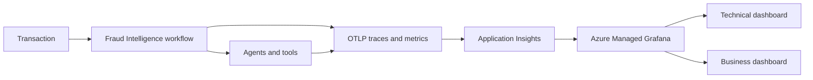

# Challenge 6 - Observe Fraud Intelligence

[Previous challenge](challenge-05.md) | **[Home](../README.md)** | [Finish](finish.md)

> **Scaffold status:** This challenge defines the intended learner journey and validation criteria. Replace the marked `TODO` items when the telemetry helpers, metric names, and Grafana dashboard assets are added to the repository.

## 🎯 Objective

Add end-to-end **OpenTelemetry Protocol (OTLP)** tracing and business metrics to the hosted fraud intelligence workflow, send telemetry to **Application Insights**, and visualize operational and business outcomes in **Azure Managed Grafana**.

## 🧭 Context and Background

Production observability must answer two kinds of questions: whether the system is healthy and whether it is delivering the intended business outcome. A shared correlation identifier connects one transaction to its workflow, agent, model, retrieval, MCP, report, and alert activity.

Telemetry must not become a second copy of sensitive financial data. Capture identifiers, timings, statuses, counts, and bounded classifications; avoid names, account numbers, full prompts, evidence payloads, and secrets.

## ✅ Tasks

### 1. Define the telemetry contract

Choose a correlation identifier that is created or accepted at the workflow boundary and propagated through every agent and tool call.

Define spans for the workflow and each major stage. Define a small set of low-cardinality business metrics, such as:

- Investigations started and completed
- Investigation duration and stage duration
- Regulatory outcomes by bounded status
- Alerts required, created, skipped, and failed
- Evidence or policy retrieval failures
- Workflow failures by stage

Document allowed attributes and explicitly exclude sensitive or high-cardinality values.

> **TODO:** Finalize metric names, units, dimensions, retention expectations, and the telemetry data-classification table.

### 2. Instrument the Agent Framework workflow

Add OpenTelemetry tracing and metrics to the Python orchestrator. Configure OTLP export with environment variables and Azure authentication rather than hard-coded connection details.

Create a root span for each investigation and child spans for enrichment, assessment, report generation, alert management, and the parallel join. Record status and exceptions without recording sensitive payloads.

Emit business metrics only after the corresponding state transition is known. Ensure retries do not inflate case or alert counts.

> **TODO:** Add the telemetry helper, dependency updates, environment template, and focused instrumentation tests under `walkthrough/challenge-06/`.

### 3. Send telemetry to Application Insights

Configure the hosted agent to export telemetry to the Application Insights resource connected in Challenge 2. Grant the hosted identity only the access required to publish telemetry.

Deploy a new hosted-agent version and run the canonical transaction plus at least one failure scenario. Allow time for ingestion, then verify that traces and metrics arrive with the expected correlation and dimensions.

> **TODO:** Add the hosted-agent settings and sample KQL queries for locating one investigation and summarizing each business metric.

### 4. Validate end-to-end traces

In Application Insights, locate one investigation by correlation identifier. Confirm that the trace shows:

- The hosted workflow entry point
- Sequential enrichment and assessment stages
- Parallel report and alert branches
- Model, Foundry IQ, and MCP activity where instrumentation is available
- Duration, success or failure, and error details for each stage
- No secrets or unnecessary financial data

Compare one successful trace with one failed trace and identify the stage responsible for the failure.

### 5. Build the Azure Managed Grafana dashboard

Connect Azure Managed Grafana to the Application Insights or Azure Monitor data source using managed identity and least privilege.

Build a dashboard with two audiences in mind:

- Technical panels: throughput, latency, failure rate, stage duration, dependency failures, and alert API health
- Business panels: investigations by regulatory status, alert outcomes, evidence gaps, and trends over time

Every panel should state its time range, unit, and aggregation. Avoid dimensions that expose customer or account data.

> **TODO:** Add the dashboard JSON or creation steps, canonical panel titles, queries, thresholds, and a screenshot of the completed dashboard.

### 6. Run the final validation

Submit several transactions that exercise alert-required, no-alert, and failure outcomes. Confirm that:

- Every invocation has one correlation identifier across the trace
- Counts agree with the submitted cases and remain correct after retries
- Trace failures match dashboard failure metrics
- Alert outcomes match the joined workflow responses
- No sensitive payloads or credentials appear in telemetry

Record the hosted-agent version and dashboard URL as the final lab outputs.

## 🚀 Go Further

Create an Azure Monitor alert for sustained workflow failures or alert-delivery failures. Define a service-level objective for successful investigations and visualize its error budget.

## 🛠️ Troubleshooting

- **No telemetry appears:** Verify the exporter configuration, Application Insights connection, identity permissions, network access, and ingestion delay.
- **Spans are disconnected:** Confirm that trace context and the correlation identifier are propagated across async and parallel branches.
- **Metrics have unexpected counts:** Check retry behavior, metric emission points, and idempotency around completed state transitions.
- **Grafana cannot query Azure Monitor:** Verify the data source, managed identity, subscription access, and Grafana role assignments.
- **Queries are slow or expensive:** Reduce the time range, remove high-cardinality dimensions, and aggregate before visualization.
- **Sensitive data appears:** Stop emitting the attribute, deploy the correction, and follow the lab's process for handling previously ingested data.

## 🧠 Conclusion

You have instrumented the complete fraud intelligence workflow and created technical and business views of its behavior. Continue to the [finish page](finish.md) to complete the MicroHack.
